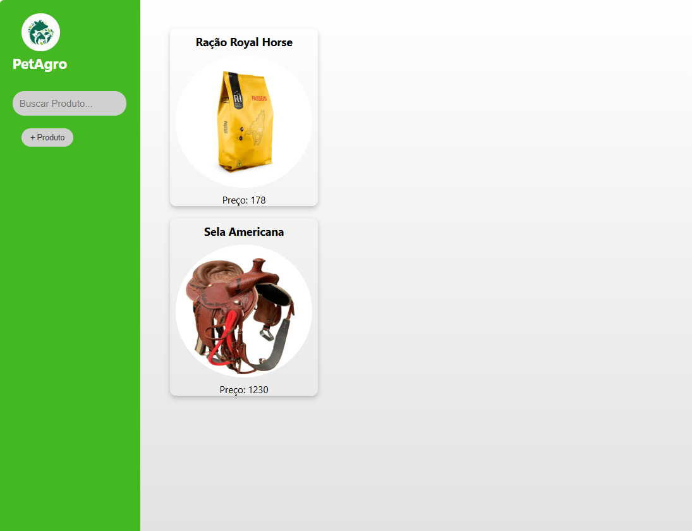
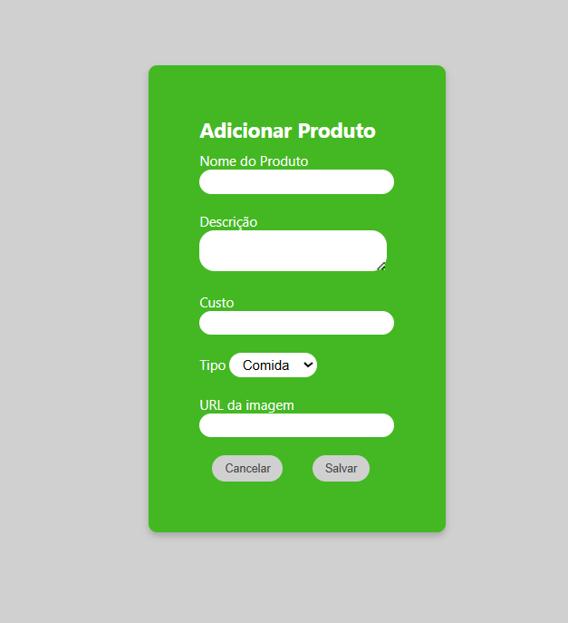
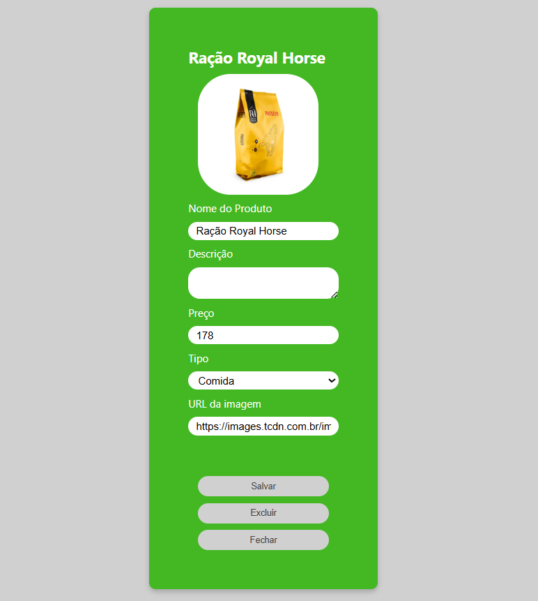

# Full Stack - PetAgro
Atividade do curso técnico em desenvolvimento de sistema que consistia em criar um aplicativo de Loja com frontend, banco de dados e backend que renderiza uma loja em json.

## Tecnologias
- Insomnia
- Xampp
- Prisma
- VsCode

## Como testar
- Clone o repositório
- Abra com VsCode, em um terminal digite:
```
- npm i -g backend-aula
- (npx) backend-aula loja...
- npm install @prisma/client
- npx prisma generate
- npx prisma migrate dev
- npm run dev
```

## Prints
| |  | |
|-|-|-|
